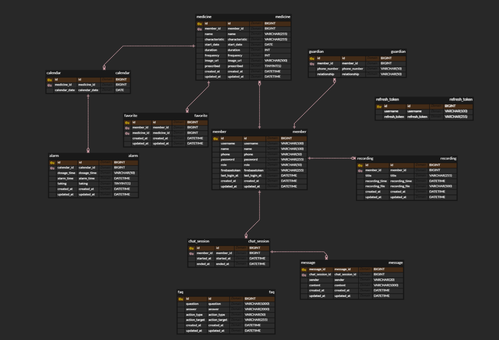

# MediTag Backend

> **시각장애인의 복약 자립성을 향상시키기 위한 AI 기반 모바일 애플리케이션, MediTag**

MediTag는 시각장애인을 위한 **NFC 기반 대화형 챗봇 복약 관리 서비스**입니다. 시각장애인이 스스로 약을 구분하고, 정해진 시간에 올바르게 복용할 수 있도록 돕는 것을 목표로 합니다.

<br>

## 📺 Project Introduction Video
(아래 이미지를 클릭하면 유튜브 영상으로 이동합니다)
https://www.youtube.com/watch?v=FvtcBnEVngo

<iframe width="560" height="315" src="https://www.youtube.com/embed/FvtcBnEVngo?si=-Wu4K7rjgZ8UGx5X" title="YouTube video player" frameborder="0" allow="accelerometer; autoplay; clipboard-write; encrypted-media; gyroscope; picture-in-picture; web-share" referrerpolicy="strict-origin-when-cross-origin" allowfullscreen></iframe>
*※ 재생 버튼을 눌러 프로젝트 시연 영상을 확인해보세요!*

<br>

## 🎯 Project Goals & Solutions

우리의 목표는 시각장애인이 타인의 도움 없이도 안전하게 약을 복용하고 건강을 관리할 수 있는 환경을 만드는 것입니다.

### 1. 오복용 방지 (Wrong Dosage Prevention)
- **Problem**: 시각장애인은 촉각만으로 비슷한 형태의 약이나 시간대별 약(아침/점심/저녁)을 구분하기 어렵습니다.
- **Solution**: **NFC 태깅 및 OCR(광학 문자 인식) 기능**을 통해 약 정보를 음성으로 안내하여 혼동을 방지합니다.

### 2. 복약 리마인드 (Medication Reminder)
- **Problem**: 약 복용 시간을 놓치거나 까먹는 경우가 빈번합니다.
- **Solution**: 정해진 시간에 `푸시 알림(FCM)`을 전송하여 복약 시점을 정확히 알려줍니다.

### 3. 보호자 연동 케어 (Guardian Care System)
- **Problem**: 환자가 약을 잘 챙겨 먹었는지 가족이나 보호자가 확인하기 어렵습니다.
- **Solution**: 복약 완료 시 **보호자에게 SMS 문자를 자동으로 전송**하여 실시간으로 복약 여부를 공유하고 관리할 수 있게 합니다.

---

## 🏗️ Architecture

*(추후 아키텍처 다이어그램 추가 예정)*

---

## 🗂️ ERD (Entity Relationship Diagram)

*(아래 공간에 ERD 이미지를 첨부해주세요)*



---

## 🛠️ Tech Stack

### Backend
- **Language**: Java 17+
- **Framework**: Spring Boot 3.x
- **Database**: MySQL (Google Cloud SQL 권장)
- **ORM**: Spring Data JPA
- **Security**: Spring Security, OAuth 2.0 (Kakao/Google Login), JWT
- **Build Tool**: Gradle

### Infra & Tools
- **Cloud**: GCP (Google Cloud Platform) or AWS
- **CI/CD**: Github Actions
- **API Documentation**: Swagger UI / SpringDoc

### Key Libraries & APIs
- **FCM (Firebase Cloud Messaging)**: 복약 알림 푸시 전송
- **CoolSMS / Naver Sens**: 보호자 SMS 문자 전송
- **STT/TTS (Speech-to-Text / Text-to-Speech)**: 대화형 챗봇 음성 안내
- **NFC/OCR Integration**: 클라이언트(앱)와 연동하여 약품 정보 처리

<br>

## 📝 API Documentation
서버가 실행 중일 때 아래 주소에서 API 명세서를 확인할 수 있습니다.
- Swagger UI: `http://localhost:8080/swagger-ui/index.html`

<br>

## 🚀 Getting Started

### 1. Clone the repository
```bash
git clone [https://github.com/your-repo/MediTag-BE.git](https://github.com/your-repo/MediTag-BE.git)
cd MediTag-BE
```
### 2. Configure Environment Variables
.env 파일 혹은 application.yml에 데이터베이스 및 API 키 설정을 완료해야 합니다.
```yaml
spring:
  datasource:
    url: jdbc:mysql://localhost:3306/meditag
    username: YOUR_DB_USERNAME
    password: YOUR_DB_PASSWORD
```
### 3. Run the Application
```bash
./gradlew bootRun
```